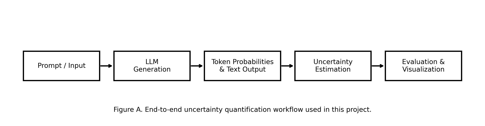
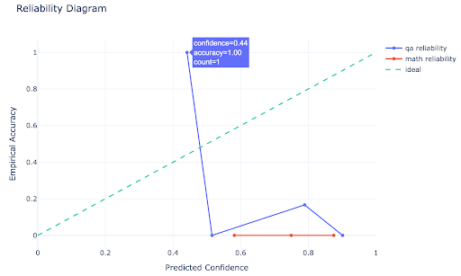
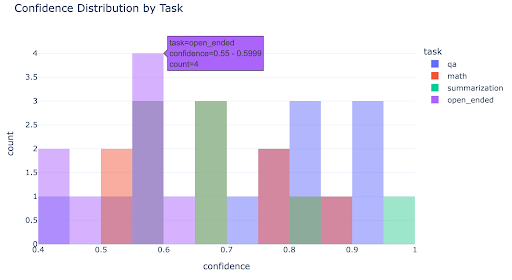
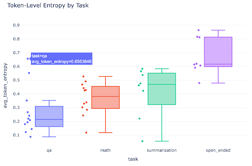
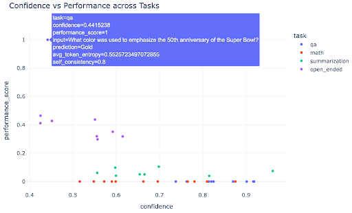
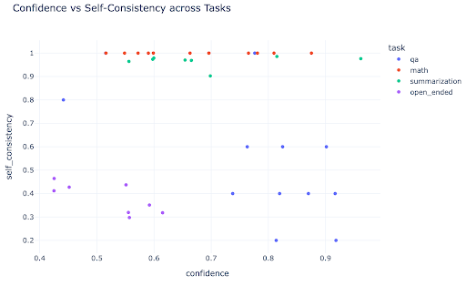
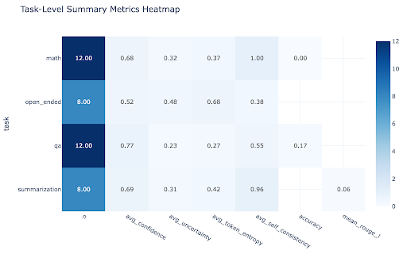

# LLM Uncertainty Evaluations

A research oriented project investigating practical uncertainty estimation techniques for autoregressive Large Language Models across multiple natural language generation tasks.

# Overview

Large Language Models are capable of generating highly fluent and coherent responses across a wide variety of tasks. However, these models frequently produce hallucinations, incorrect reasoning, and overconfident outputs despite sounding linguistically convincing.

This project explores practical uncertainty quantification methods for open source transformer based language models in order to better understand:
- when language models are uncertain,
- how uncertainty correlates with correctness,
- how uncertainty behaves across different task categories,
- and how well confidence estimates are calibrated.

The project evaluates uncertainty across:
- factual question answering,
- mathematical reasoning,
- summarization,
- and open ended text generation.

---

# Project Goals

The primary objectives of this work are:

1. Estimate uncertainty at both token and sentence levels.
2. Compare multiple uncertainty estimation techniques.
3. Analyze uncertainty behavior across different task types.
4. Study the relationship between uncertainty and model performance.
5. Evaluate calibration quality using reliability diagrams.
6. Build a reproducible and interpretable uncertainty analysis pipeline.

---

# Methodology

The overall workflow consists of:
1. Prompt generation and dataset preparation
2. Autoregressive language model inference
3. Token probability extraction
4. Uncertainty estimation
5. Evaluation and calibration analysis
6. Visualization and interpretation

---

# Pipeline Overview



Interactive version:  
[Open HTML Visualization](results/plots/pipeline_diagram.html)

---

# Implemented Uncertainty Estimation Methods

## 1. Token Entropy

Token entropy measures uncertainty using the probability distribution over the vocabulary at each decoding step.

Higher entropy indicates greater uncertainty and lower confidence in the generated token.

Advantages:
- computationally efficient,
- directly available during generation,
- easy to interpret.

---

## 2. Average Sequence Log Probability

Average sequence log probability estimates overall confidence in the generated response.

Lower sequence probability generally corresponds to higher uncertainty.

Advantages:
- simple implementation,
- useful confidence baseline.

Limitations:
- sensitive to sequence length,
- may favor fluent but incorrect outputs.

---

## 3. Self Consistency Sampling

Multiple stochastic generations are sampled for the same prompt and compared for semantic agreement.

High disagreement among generated responses indicates increased uncertainty.

Advantages:
- captures semantic uncertainty,
- useful for reasoning and hallucination analysis.

Limitations:
- computationally expensive,
- requires repeated generation.

---

# Datasets

Experiments were conducted using representative subsets from the following datasets:

| Task | Dataset |
|---|---|
| Factual QA | SQuAD |
| Mathematical Reasoning | GSM8K |
| Summarization | CNN DailyMail |
| Open Ended Generation | Custom prompts |

Representative subsets were used to ensure computational feasibility within limited runtime constraints.

---

# Experimental Setup

Experiments were conducted using:
- Google Colab GPU environment
- HuggingFace Transformers
- PyTorch
- Plotly
- Pandas
- NumPy
- Scikit learn

The implementation uses open source autoregressive transformer models such as:
- TinyLlama
- Phi 2
- Mistral Instruct variants

---

# Results and Analysis

## Reliability Diagram

The reliability diagram compares predicted confidence against empirical accuracy across confidence bins.



Interactive version:  
[Open HTML Visualization](results/plots/reliability_diagram.html)

### Key Observation

The model exhibits noticeable overconfidence in several regions, particularly for hallucination prone outputs and longer generation tasks.

---

## Confidence Distribution Across Tasks



Interactive version:  
[Open HTML Visualization](results/plots/confidence_distribution_by_task.html)

### Key Observation

Factual QA tasks generally produce higher confidence scores, while open ended generation tasks exhibit broader uncertainty distributions.

---

## Token Level Entropy Across Tasks



Interactive version:  
[Open HTML Visualization](results/plots/token_entropy_by_task.html)

### Key Observation

Open ended and summarization tasks show higher entropy values due to increased semantic variability and generation diversity.

---

## Confidence versus Performance



Interactive version:  
[Open HTML Visualization](results/plots/confidence_vs_performance.html)

### Key Observation

Higher confidence predictions generally correlate with improved performance, although high confidence failures still occur.

---

## Confidence versus Self Consistency



Interactive version:  
[Open HTML Visualization](results/plots/confidence_vs_self_consistency.html)

### Key Observation

Predictions with stronger self consistency across sampled generations typically exhibit lower uncertainty.

---

## Task Level Summary Metrics



Interactive version:  
[Open HTML Visualization](results/plots/task_summary_heatmap.html)

### Key Observation

Uncertainty behavior varies significantly across tasks, highlighting the importance of task specific uncertainty analysis.

---

# Key Findings

- Token entropy provides a lightweight and effective uncertainty signal.
- Self consistency produces stronger semantic uncertainty estimates but requires significantly higher computational cost.
- Factual QA tasks exhibit relatively stable uncertainty distributions.
- Mathematical reasoning tasks show fluctuating uncertainty during intermediate reasoning steps.
- Summarization and open ended generation exhibit substantially higher uncertainty variability.
- Current language models remain imperfectly calibrated and frequently demonstrate overconfidence.

---

# Repository Structure

```text
llm-uncertainty-quantification/
│
├── notebooks/
│   └── track2_uncertainty_notebook.ipynb
│
├── report/
│   └── uncertainty_report.pdf
│
├── results/
│   ├── plots/
│   ├── tables/
│   └── metrics/
│
├── README.md
├── requirements.txt
└── LICENSE
```

# Installation

Clone the repository:

git clone https://github.com/your-username/llm-uncertainty-quantification.git
cd llm-uncertainty-quantification

Install dependencies:

pip install -r requirements.txt

⸻

# Running the Notebook

Launch Jupyter Notebook or open the notebook in Google Colab:

jupyter notebook

Then open:

notebooks/track2_uncertainty_notebook.ipynb

⸻

# Future Work

Potential future extensions include:

* semantic entropy estimation,
* Bayesian uncertainty methods,
* ensemble based uncertainty estimation,
* retrieval augmented uncertainty analysis,
* uncertainty aware decoding,
* larger scale benchmarking,
* human centered uncertainty evaluation.

⸻

# References

1. HuggingFace Transformers Documentation
2. SelfCheckGPT: Zero Resource Black Box Hallucination Detection for Generative Large Language Models
3. Semantic Entropy for Language Model Uncertainty
4. GSM8K Dataset
5. CNN DailyMail Dataset
6. SQuAD Dataset

⸻

# License

This project is released under the MIT License.
